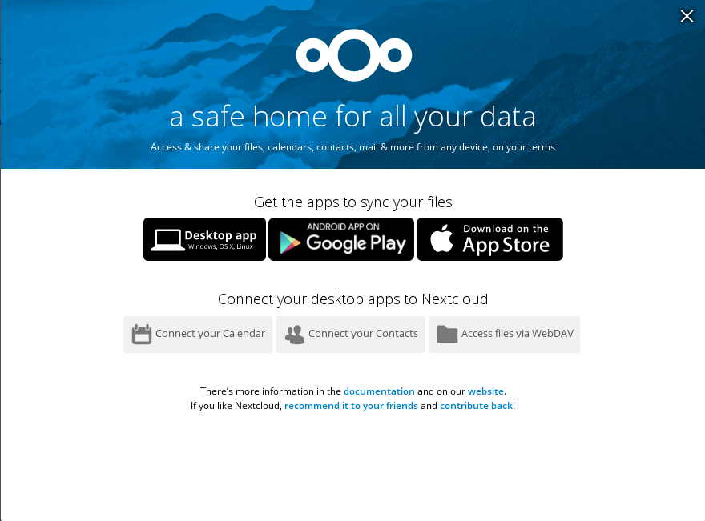

= Nextcloud
Chuck Frain <chuck@chuckfrain.net>
:backend: deckjs
:navigation:
:split:
:toc: left
// subs for this doc
:nex: Nextcloud
:nexv: 12.0.0
:nexzip: nextcloud-{nexv}.zip
:calug: Columbia Area Linux User Group
:ca: CALUG

//[discrete]
== Why {nex}?

image::images/cloud_others_computer.jpg[]

== Presentation Notes

This presentation is not a replacement for the detailed instructions from {nex}.
Downloads and documentation are available at https://nextcloud.com/install

For the {nex} server installation we'll talk about and install {nex} {nexv}
// ** We'll be using the {nexzip} file

The demo system is running CentOS 7.3 with the following installed and configured:

* Apache webserver
* PHP 7 (5.6 or higher is required for {nex} 11.x and higher)
** Required php modules
* MariaDB
* Firewall ports 80 and 443 opened

(See the appendix for details )

== Server Installation

. Download the {nexzip} file from the {nex} site.
. Unzip the downloaded file using the command `unzip {nexzip} -d /var/www/html/`
.. The files will be extracted to /var/www/html/nextcloud
. Create or know the path to the data directory.
For this example we will create and use `/var/www/html/nextcloud/data` (but is not recommended for production)
. Change ownership of the Nextcloud directories to the web user and group with the command `chown -R apache:apache /var/www/html/nextcloud`
. Modify the selinux permissions of the directories (see appendix)
. Navigate to the server with your web browser `\https://<host or ip>/nextcloud` to complete the Installation Wizard

<<<<

image::images/nextcloud_setup_screen.png[]

Select the appropriate options and click the `Finish setup` button to complete
//demo

<<<<

== Demo Interface

*Demo Time!*

== Clients

Clients are available for all major platforms

* Desktop
** Linux
** MacOs/OS X
** Windows
* Android
* iOS

//demo

== Other ways to access files and data

* WebDAV
* Web interface
* Calendar Data
** CalDAV
* Contacts
** CardDAV

== Other options for getting started

* Nextcloud Appliance
* Docker image
* Virtual Machine
* Hosted Website

== Features

* Federation
* Encryption
* Full text search
* Various Authentication Methods
** LDAP
** Kerberos
** SSO/SAML
** Dual Factor (U2F/TOTP)

<<<<

* Apps
** Collabora Online
** News (RSS Reader)
** Mail Client (IMAP/SMTP)
** Notes
** Tasks
** Keeweb (Keepass Client)
** SMS Sync
** Video Calls

More information at https://nextcloud.com/

== External Access

* VPN (Secure)
* DMZ/Port Forwarding (Less Secure)

== Resources

https://nextcloud.com

https://nextcloud.com/install/

https://nextcloud.com/collaboraonline/

*Links to this presentation*

[cols=2*^,options="header"]
|===
|html |github
|https://goo.gl/A9zh2c |https://github.com/chuckf/nextcloud_talk
a|image::images/pres_html.png[]
// a|image::images/pres_slides.png[]
a|image::images/github.png[]
|===

== Appendix

include::appendix/nextcloud_talk_setup.adoc[]
include::appendix/apache_config.adoc[]
include::appendix/permissions.adoc[]
include::appendix/mysql_config.adoc[]
